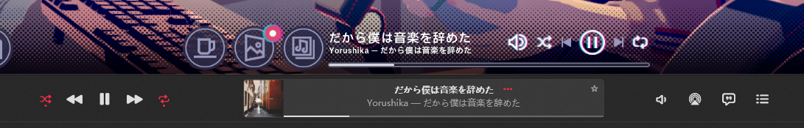

# Chill Music Information Sync (音乐信息同步)

一个用于游戏 《*放松时光：与你共享Lo-Fi故事*》 的 BepInEx 插件，可以实现与Windows媒体控制API (SMTC)双向同步的Mod

---

> 「放松时光：与你共享Lo-Fi故事」是一个与喜欢写故事的女孩聪音一起工作的有声小说游戏。您可以自定义艺术家的原创乐曲、环境音和风景，以营造一个专注于工作的环境。在与聪音的关系加深的过程中，您可能会发现与她之间的特别联系。
---
## 实际使用效果：

## ！！注意 ！！

使用SMTC需要你的音乐播放器支持，并且并不是所有播放器都支持SMTC的全部功能

比如Apple Music桌面端就无法双向同步进度条

常见的支持SMTC的音乐播放器有：

- Spotify
- Groove Music
- YouTube(Chrome)
- Bilibili(Chrome)
- Apple Music(不支持游戏内拖动进度条)
- 网易云音乐 With [BetterNCM](https://github.com/std-microblock/chromatic/tree/v2)

## 主要功能

### 播放器侧

- 曲名同步
- 艺术家同步
- 歌曲封面同步
- 播放状态同步
- 进度条双向同步

### 游戏侧

- 上一曲
- 下一曲
- 暂停/播放
- 进度条拖动

## 使用方法

由于Unity Mono运行时的限制，无法调用Windows API，所以本项目需要用到[SMTC-Bridge-Cpp](https://github.com/Cainongw/SMTC-Bridge-Cpp)去在Native层操作

在Relaese中已经包含，如果您不需要自行编译使用可以无视上面这段话

---
### **您需要：**

- 游戏本体
- BepInEx 5.4.23.4 (与[RealTimeWeatherMod](https://github.com/Small-tailqwq/RealTimeWeatherMod)是相同的)

### 安装步骤

1. 确保已正确安装 BepInEx 框架
2. 启动一次游戏
3. 将Relaese中的所有内容解压放到BepInEx\plugins
4. 启动游戏

## 关于随机播放/重复播放

各家播放器对于随机播放和循环播放的控制做的很差

即使SMTC库中包含对于随机播放和重复播放的控制，但测试之后并没有播放器支持

并且各个播放器实现的逻辑也不一样，有的将随机/列表/单曲重复放在一起，有的将随机与重复分开

所以如果想实现的话最好的方式或许是模拟快捷键调用

因此目前暂时没有支持的计划，目前打算是在播放时候禁用并隐藏游戏的这两个UI按钮

## 说明

- Mod在检测到没有任何SMTC Session在播放的时候不会接管游戏的音乐控制，此时您可以正常使用游戏内的音乐播放器

## Todo list

- [x] 增加歌曲封面同步
- [x] 在播放时隐藏游戏的循环/随机按钮
- [x] 为封面/按钮的出现和隐藏增加动画
